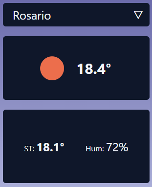

# Telecom Challenge


## Contacto
Email
juanchemell@gmail.com

## Corriendo el proyecto
1. Instalar dependencias del proyecto
```bash
yarn
```

2. Agregar `VITE_API_KEY` en archivo `.env`, obtener desde [aquí](https://home.openweathermap.org/api_keys)

3. Correr servidor de desarrollo
```bash
yarn dev
```
